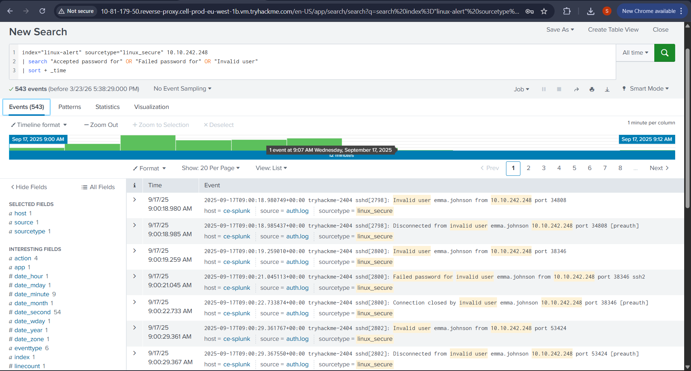
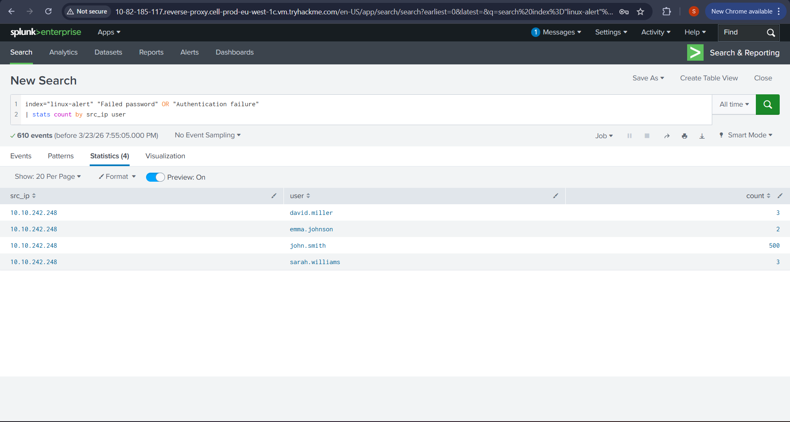
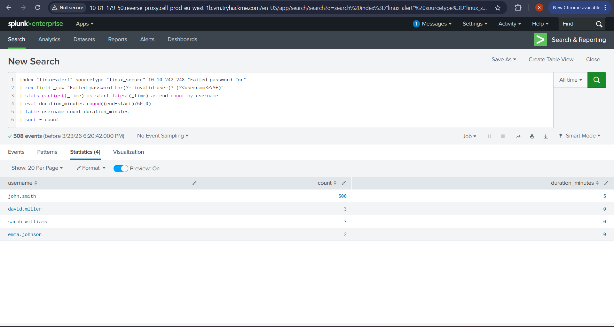

# 🔐 SOC Investigation: Brute Force Login Detection on Linux

## 📌 Overview
This project demonstrates a SOC Level 1 investigation into a brute-force attack targeting SSH authentication on a Linux system. The investigation was performed using Splunk SIEM and Linux authentication logs to identify attack patterns, targeted usernames, and overall incident severity.

---

## 🚨 Scenario
Suspicious SSH authentication activity was detected from source IP `10.10.242.248`. The logs showed repeated failed password attempts and invalid user activity against multiple accounts, indicating a possible brute-force attack.

---

## 🎯 Objective
The objective of this investigation was to:

- Detect failed SSH login attempts
- Identify the usernames targeted by the attacker
- Determine whether the activity matched brute-force behavior
- Document findings using SOC-style investigation methodology

---

## 🔍 Investigation Summary
An alert was triggered due to repeated failed SSH login attempts from a single source IP.  
The investigation showed:

- Multiple `Failed password` events
- `Invalid user` attempts indicating username enumeration
- Repeated targeting of multiple user accounts
- A clear brute-force pattern over time

The activity was assessed as a **brute-force attack attempt** against a Linux host.

---

## 🧪 Tools & Technologies
- Splunk SIEM
- Linux authentication logs (`linux_secure`)
- SPL queries
- MITRE ATT&CK Framework

---

## 📊 Key Findings
- Source IP `10.10.242.248` generated repeated failed SSH authentication attempts
- Multiple usernames were targeted
- Invalid user attempts were observed
- Attack behavior aligned with brute-force and SSH remote access techniques

---

## 🧠 MITRE ATT&CK Mapping
- **T1110 — Brute Force**
- **T1021.004 — Remote Services: SSH**

---

## 🧠 Analyst Decision
Based on log analysis, repeated failed SSH logins, and targeted username activity, this event was classified as a **brute-force attack attempt**.

**Severity:** Medium  
**Reason:** High volume of failed attempts from a single IP, but no confirmed compromise

---

## 🛡️ Recommendations
- Block the malicious IP address
- Disable SSH password authentication where possible
- Enforce strong password policies
- Implement fail2ban or similar protection
- Disable direct root SSH login
- Continue SIEM monitoring for repeated authentication attacks

---

## 📸 Evidence Screenshots

### Authentication Activity


*Figure 1: Linux SSH authentication logs showing failed and invalid login activity from source IP 10.10.242.248.*

### Failed Login Pattern


*Figure 2: Repeated failed password attempts indicating brute-force behavior.*

### Targeted Users Analysis


*Figure 3: Username-based analysis showing the most targeted accounts and attack duration.*

---

## 📎 Investigation Files
- Full report: [`report/linux_brute_force_splunk_report.pdf`](report/linux_brute_force_splunk_report.pdf)
- Splunk queries: [`queries/splunk_queries.md`](queries/splunk_queries.md)

---

## 📁 Project Structure
```text
soc-brute-force-detection/
│
├── README.md
├── report/
│   └── linux_brute_force_splunk_report.pdf
├── queries/
│   └── splunk_queries.md
├── screenshots/
│   ├── authentication_activity.png
│   ├── failed_login_pattern.png
│   └── targeted_users_analysis.png
```
---
## 💡 Skills Demonstrated

- SIEM-based alert triage

- Linux log analysis

- SSH brute-force detection

- Splunk query development

- MITRE ATT&CK mapping

- SOC investigation reporting

## 👤 Author

Sahil Pathak 

Aspiring SOC Analyst | Cyber Security Graduate
